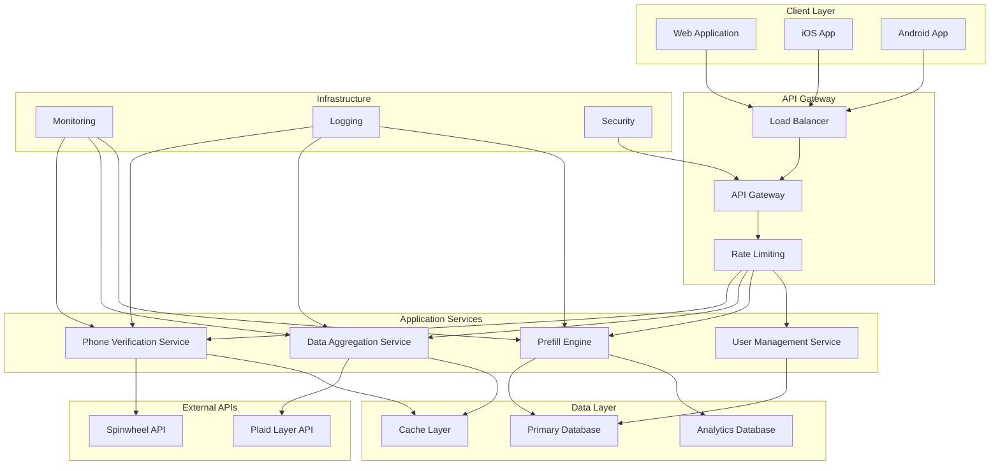
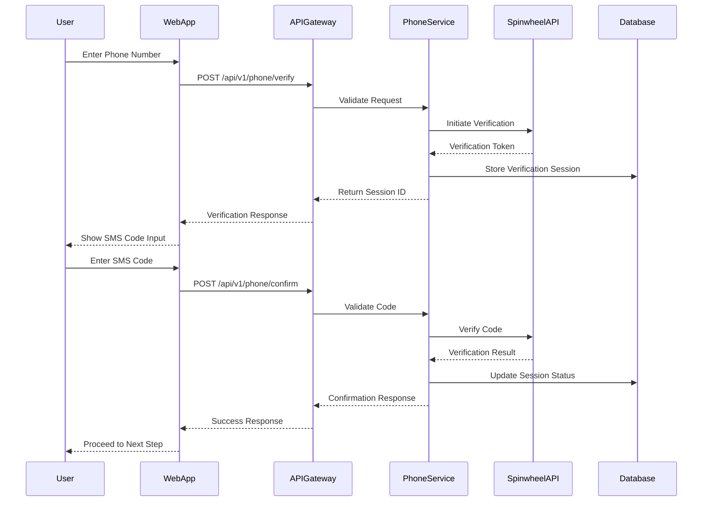
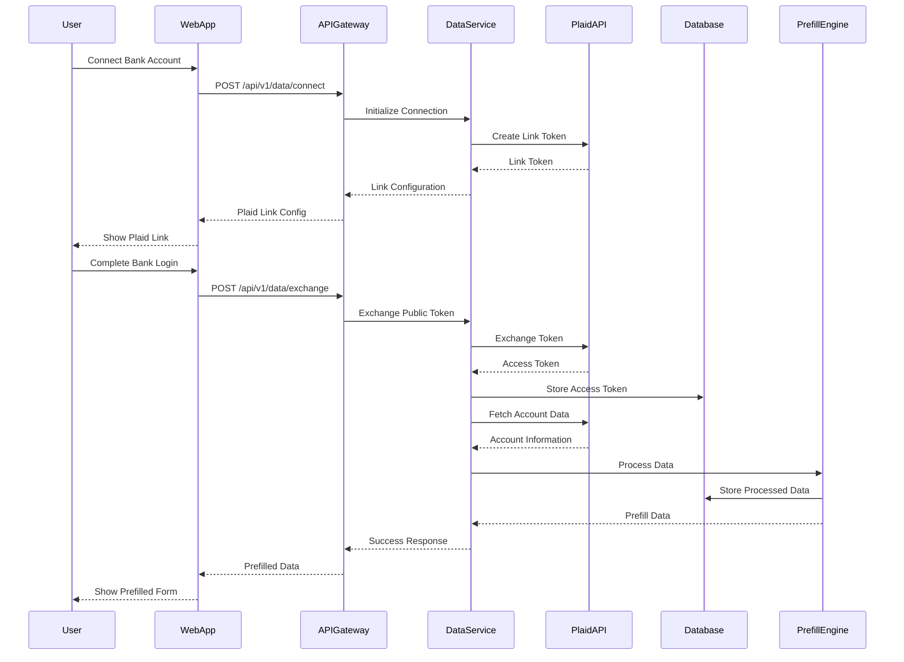
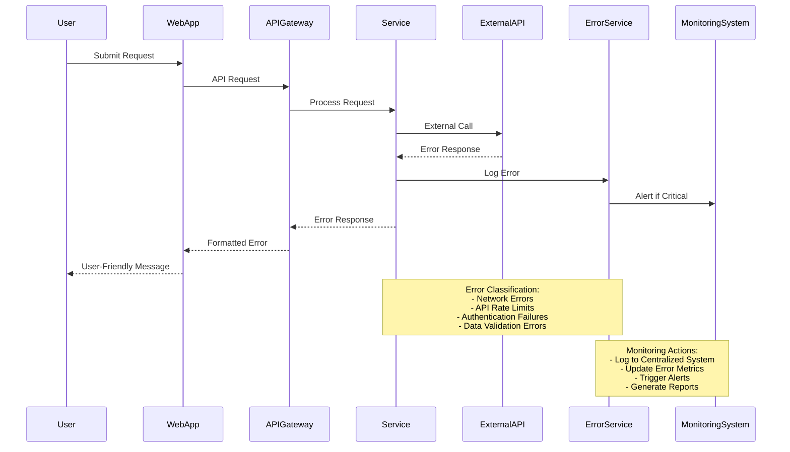

# Consumer Data Prefill Solution Design Document

## Executive Summary

This design document outlines the architecture and implementation strategy for a comprehensive consumer data prefill solution that leverages Plaid Layer and Spinwheel APIs to streamline user onboarding processes. The solution provides automated data collection, verification, and prefill capabilities for financial applications, significantly reducing user friction and improving conversion rates.

### Key Benefits
- **Reduced User Friction**: Automated data collection eliminates manual form filling
- **Improved Accuracy**: Direct API integration ensures data accuracy and consistency
- **Enhanced Security**: Enterprise-grade security with PCI DSS and SOC 2 compliance
- **Scalable Architecture**: Multi-tenant design supporting white-label implementations
- **Cross-Platform Support**: Web, iOS, and Android implementations

### Success Metrics
- **Conversion Rate Improvement**: Target 40-60% increase in application completion rates
- **Time to Complete**: Reduce average form completion time by 70-80%
- **Data Accuracy**: Achieve 99.5% data accuracy through automated collection
- **User Satisfaction**: Target Net Promoter Score (NPS) above 70

---

## Table of Contents

1. [System Overview](#system-overview)
2. [Architecture Overview](#architecture-overview)
3. [Data Flow Diagrams](#data-flow-diagrams)
4. [API Integration Strategy](#api-integration-strategy)
5. [Platform Implementations](#platform-implementations)
6. [Security Considerations](#security-considerations)
7. [Data Models](#data-models)
8. [Implementation Timeline](#implementation-timeline)
9. [Risk Analysis](#risk-analysis)
10. [Monitoring and Analytics](#monitoring-and-analytics)

---

## System Overview

### Problem Statement
Modern financial applications require extensive user information during onboarding, leading to:
- High abandonment rates (60-80% for complex forms)
- Data entry errors and inconsistencies
- Extended time-to-completion (15-30 minutes average)
- Poor user experience and satisfaction

### Solution Architecture
Our consumer data prefill solution addresses these challenges through:
- **Automated Phone Verification**: Spinwheel API integration for phone number validation
- **Financial Data Aggregation**: Plaid Layer API for comprehensive financial information
- **Intelligent Data Mapping**: Automated field population based on collected data
- **Multi-Platform Support**: Consistent experience across web and mobile platforms

### Core Components

#### 1. Phone Verification Service
- **Provider**: Spinwheel API
- **Functionality**: Phone number validation and verification
- **Features**: SMS/Voice verification, carrier detection, fraud prevention
- **Integration**: RESTful API with webhook support

#### 2. Financial Data Aggregation
- **Provider**: Plaid Layer API
- **Functionality**: Bank account linking and data retrieval
- **Features**: Account balances, transaction history, identity verification
- **Integration**: OAuth 2.0 flow with secure token management

#### 3. Data Prefill Engine
- **Functionality**: Intelligent field mapping and population
- **Features**: Schema validation, data transformation, error handling
- **Integration**: Microservices architecture with API gateway

#### 4. Tenant Management System
- **Functionality**: Multi-tenant configuration and white-label support
- **Features**: Custom branding, API key management, analytics dashboard
- **Integration**: Admin portal with role-based access control

---

## Architecture Overview

### High-Level Architecture



### Component Architecture

#### API Gateway Layer
- **Load Balancer**: Traffic distribution and failover
- **API Gateway**: Request routing and protocol translation
- **Rate Limiting**: API quota management and DDoS protection
- **Authentication**: JWT token validation and authorization

#### Service Layer
- **Phone Verification Service**: Handles Spinwheel API integration
- **Data Aggregation Service**: Manages Plaid Layer API connections
- **Prefill Engine**: Processes and maps collected data
- **User Management Service**: Handles user sessions and profiles

#### Data Layer
- **Primary Database**: PostgreSQL for transactional data
- **Cache Layer**: Redis for session management and performance
- **Analytics Database**: ClickHouse for real-time analytics

---

## Data Flow Diagrams

### Phone Verification Flow



### Data Aggregation Flow



### Error Handling Flow



---

## API Integration Strategy

### Spinwheel API Integration

#### Phone Verification Endpoints
```javascript
// Initialize Phone Verification
POST /api/v1/phone/verify
{
  "phone_number": "+1234567890",
  "country_code": "US",
  "method": "sms" // or "voice"
}

// Confirm Verification Code
POST /api/v1/phone/confirm
{
  "session_id": "uuid",
  "verification_code": "123456"
}

// Check Verification Status
GET /api/v1/phone/status/{session_id}
```

#### Implementation Details
- **Authentication**: API key-based authentication
- **Rate Limiting**: 100 requests per minute per IP
- **Retry Logic**: Exponential backoff with jitter
- **Timeout**: 30 seconds for API calls
- **Error Handling**: Comprehensive error classification

### Plaid Layer API Integration

#### Account Linking Flow
```javascript
// Create Link Token
POST /api/v1/plaid/link-token
{
  "user_id": "user123",
  "client_name": "Your App Name",
  "country_codes": ["US"],
  "language": "en",
  "products": ["identity", "accounts", "transactions"]
}

// Exchange Public Token
POST /api/v1/plaid/exchange-token
{
  "public_token": "public-token-uuid",
  "user_id": "user123"
}

// Fetch Account Data
GET /api/v1/plaid/accounts/{user_id}
```

#### Data Retrieval Strategy
- **Identity Information**: Name, address, phone, email
- **Account Details**: Account numbers, routing numbers, balances
- **Transaction History**: Recent transactions for income verification
- **Employment Data**: Employer information if available

---

## Platform Implementations

### Web Platform (JavaScript/TypeScript)

#### Frontend Architecture
```typescript
// Phone Verification Component
interface PhoneVerificationProps {
  onSuccess: (phoneData: PhoneData) => void;
  onError: (error: Error) => void;
}

class PhoneVerification extends React.Component<PhoneVerificationProps> {
  private async verifyPhone(phoneNumber: string): Promise<void> {
    try {
      const response = await fetch('/api/v1/phone/verify', {
        method: 'POST',
        headers: { 'Content-Type': 'application/json' },
        body: JSON.stringify({ phone_number: phoneNumber })
      });
      
      const data = await response.json();
      this.setState({ sessionId: data.session_id });
    } catch (error) {
      this.props.onError(error);
    }
  }
}

// Data Aggregation Component
interface DataAggregationProps {
  userId: string;
  onDataReady: (prefillData: PrefillData) => void;
}

class DataAggregation extends React.Component<DataAggregationProps> {
  private async initializePlaidLink(): Promise<void> {
    const linkToken = await this.createLinkToken();
    const plaidLink = new PlaidLink({
      token: linkToken,
      onSuccess: this.handlePlaidSuccess,
      onExit: this.handlePlaidExit
    });
    plaidLink.open();
  }
}
```

#### State Management
```typescript
// Redux Store Configuration
interface AppState {
  phoneVerification: PhoneVerificationState;
  dataAggregation: DataAggregationState;
  prefillData: PrefillDataState;
  ui: UIState;
}

// Actions
export const phoneVerificationActions = {
  verifyPhone: (phoneNumber: string) => async (dispatch: Dispatch) => {
    dispatch({ type: 'PHONE_VERIFICATION_START' });
    try {
      const result = await phoneService.verify(phoneNumber);
      dispatch({ type: 'PHONE_VERIFICATION_SUCCESS', payload: result });
    } catch (error) {
      dispatch({ type: 'PHONE_VERIFICATION_ERROR', payload: error });
    }
  }
};
```

### iOS Platform (Swift)

#### Service Layer
```swift
// Phone Verification Service
class PhoneVerificationService {
    private let apiClient: APIClient
    private let baseURL = "https://api.yourapp.com/v1"
    
    func verifyPhone(phoneNumber: String) async throws -> PhoneVerificationResponse {
        let request = PhoneVerificationRequest(phoneNumber: phoneNumber)
        let response = try await apiClient.post(
            "\(baseURL)/phone/verify",
            body: request
        )
        return try JSONDecoder().decode(PhoneVerificationResponse.self, from: response)
    }
    
    func confirmVerification(sessionId: String, code: String) async throws -> ConfirmationResponse {
        let request = ConfirmationRequest(sessionId: sessionId, code: code)
        let response = try await apiClient.post(
            "\(baseURL)/phone/confirm",
            body: request
        )
        return try JSONDecoder().decode(ConfirmationResponse.self, from: response)
    }
}

// Data Aggregation Service
class DataAggregationService {
    private let plaidLinkManager: PlaidLinkManager
    
    func initializePlaidLink(userId: String) async throws -> PlaidLinkConfiguration {
        let linkToken = try await createLinkToken(userId: userId)
        return PlaidLinkConfiguration(linkToken: linkToken)
    }
    
    func handlePlaidSuccess(publicToken: String, metadata: PlaidSuccessMetadata) async throws {
        let exchangeRequest = TokenExchangeRequest(
            publicToken: publicToken,
            userId: metadata.userId
        )
        let response = try await apiClient.post(
            "\(baseURL)/plaid/exchange-token",
            body: exchangeRequest
        )
        // Handle successful token exchange
    }
}
```

#### UI Components
```swift
// SwiftUI Phone Verification View
struct PhoneVerificationView: View {
    @StateObject private var viewModel = PhoneVerificationViewModel()
    @State private var phoneNumber = ""
    @State private var verificationCode = ""
    
    var body: some View {
        VStack(spacing: 20) {
            TextField("Phone Number", text: $phoneNumber)
                .textFieldStyle(RoundedBorderTextFieldStyle())
                .keyboardType(.phonePad)
            
            Button("Verify Phone") {
                Task {
                    await viewModel.verifyPhone(phoneNumber)
                }
            }
            .disabled(phoneNumber.isEmpty)
            
            if viewModel.isVerificationSent {
                TextField("Verification Code", text: $verificationCode)
                    .textFieldStyle(RoundedBorderTextFieldStyle())
                    .keyboardType(.numberPad)
                
                Button("Confirm Code") {
                    Task {
                        await viewModel.confirmCode(verificationCode)
                    }
                }
                .disabled(verificationCode.isEmpty)
            }
        }
        .padding()
        .alert("Error", isPresented: $viewModel.hasError) {
            Button("OK") { }
        } message: {
            Text(viewModel.errorMessage)
        }
    }
}
```

### Android Platform (Kotlin)

#### Service Layer
```kotlin
// Phone Verification Service
class PhoneVerificationService(
    private val apiClient: ApiClient,
    private val baseUrl: String = "https://api.yourapp.com/v1"
) {
    suspend fun verifyPhone(phoneNumber: String): PhoneVerificationResponse {
        val request = PhoneVerificationRequest(phoneNumber = phoneNumber)
        return apiClient.post(
            url = "$baseUrl/phone/verify",
            body = request
        )
    }
    
    suspend fun confirmVerification(
        sessionId: String,
        code: String
    ): ConfirmationResponse {
        val request = ConfirmationRequest(
            sessionId = sessionId,
            code = code
        )
        return apiClient.post(
            url = "$baseUrl/phone/confirm",
            body = request
        )
    }
}

// Data Aggregation Service
class DataAggregationService(
    private val context: Context,
    private val apiClient: ApiClient
) {
    private val plaidLinkManager = PlaidLinkManager(context)
    
    suspend fun initializePlaidLink(userId: String): PlaidLinkConfiguration {
        val linkToken = createLinkToken(userId)
        return PlaidLinkConfiguration(linkToken = linkToken)
    }
    
    fun launchPlaidLink(
        configuration: PlaidLinkConfiguration,
        onSuccess: (PlaidSuccessResult) -> Unit,
        onError: (PlaidErrorResult) -> Unit
    ) {
        val linkTokenConfiguration = LinkTokenConfiguration.builder()
            .token(configuration.linkToken)
            .build()
            
        PlaidLink.create(
            application = context.applicationContext as Application,
            configuration = linkTokenConfiguration
        ) { linkResult ->
            when (linkResult) {
                is LinkSuccess -> onSuccess(PlaidSuccessResult(linkResult))
                is LinkError -> onError(PlaidErrorResult(linkResult))
            }
        }
    }
}
```

#### UI Components (Jetpack Compose)
```kotlin
// Phone Verification Composable
@Composable
fun PhoneVerificationScreen(
    viewModel: PhoneVerificationViewModel = hiltViewModel(),
    onVerificationComplete: (PhoneData) -> Unit
) {
    val uiState by viewModel.uiState.collectAsState()
    
    Column(
        modifier = Modifier
            .fillMaxSize()
            .padding(16.dp),
        verticalArrangement = Arrangement.spacedBy(16.dp)
    ) {
        OutlinedTextField(
            value = uiState.phoneNumber,
            onValueChange = viewModel::updatePhoneNumber,
            label = { Text("Phone Number") },
            keyboardOptions = KeyboardOptions(keyboardType = KeyboardType.Phone),
            modifier = Modifier.fillMaxWidth()
        )
        
        Button(
            onClick = { viewModel.verifyPhone() },
            enabled = uiState.phoneNumber.isNotEmpty() && !uiState.isLoading,
            modifier = Modifier.fillMaxWidth()
        ) {
            if (uiState.isLoading) {
                CircularProgressIndicator(modifier = Modifier.size(16.dp))
            } else {
                Text("Verify Phone")
            }
        }
        
        if (uiState.isVerificationSent) {
            OutlinedTextField(
                value = uiState.verificationCode,
                onValueChange = viewModel::updateVerificationCode,
                label = { Text("Verification Code") },
                keyboardOptions = KeyboardOptions(keyboardType = KeyboardType.Number),
                modifier = Modifier.fillMaxWidth()
            )
            
            Button(
                onClick = { viewModel.confirmCode() },
                enabled = uiState.verificationCode.isNotEmpty() && !uiState.isLoading,
                modifier = Modifier.fillMaxWidth()
            ) {
                Text("Confirm Code")
            }
        }
    }
    
    LaunchedEffect(uiState.verificationResult) {
        uiState.verificationResult?.let { result ->
            onVerificationComplete(result)
        }
    }
}
```

---

## Security Considerations

### Data Protection Standards

#### PCI DSS Compliance
- **Scope**: All payment card data handling
- **Requirements**:
  - Secure network architecture with firewalls
  - Strong access controls and authentication
  - Regular security testing and monitoring
  - Data encryption in transit and at rest
  - Secure development practices

#### SOC 2 Type II Compliance
- **Security**: Logical and physical access controls
- **Availability**: System availability and performance monitoring
- **Processing Integrity**: Complete and accurate data processing
- **Confidentiality**: Information designated as confidential
- **Privacy**: Personal information collection and processing

### Privacy Regulations

#### GDPR Compliance (EU)
- **Data Minimization**: Collect only necessary data
- **Purpose Limitation**: Use data only for stated purposes
- **Storage Limitation**: Retain data only as long as necessary
- **Accuracy**: Ensure data accuracy and allow corrections
- **User Rights**: Right to access, rectify, erase, and port data

#### CCPA Compliance (California)
- **Transparency**: Clear privacy notices and data collection practices
- **Consumer Rights**: Access, deletion, and opt-out rights
- **Non-Discrimination**: No adverse treatment for exercising rights
- **Data Security**: Reasonable security measures for personal information

### Security Architecture

#### Encryption Standards
```yaml
# Data Encryption Configuration
encryption:
  in_transit:
    protocol: TLS 1.3
    cipher_suites:
      - TLS_AES_256_GCM_SHA384
      - TLS_CHACHA20_POLY1305_SHA256
    certificate_validation: strict
    
  at_rest:
    algorithm: AES-256-GCM
    key_management: AWS KMS
    key_rotation: 90_days
    
  application_layer:
    sensitive_fields:
      - phone_numbers
      - account_numbers
      - personal_identifiers
    encryption_method: field_level
```

#### Access Control
```yaml
# Role-Based Access Control (RBAC)
rbac:
  roles:
    - name: tenant_admin
      permissions:
        - read:tenant_data
        - write:tenant_config
        - read:analytics
    
    - name: developer
      permissions:
        - read:api_logs
        - write:api_config
        - read:system_metrics
    
    - name: support
      permissions:
        - read:user_data
        - write:support_tickets
        - read:error_logs
        
  authentication:
    methods:
      - jwt_tokens
      - oauth2
      - api_keys
    token_expiry: 1_hour
    refresh_token_expiry: 30_days
```

---

## Data Models

### Core Data Structures

#### User Profile
```typescript
interface UserProfile {
  id: string;
  tenantId: string;
  externalUserId: string;
  phoneNumber: string;
  phoneVerified: boolean;
  phoneVerificationDate: Date;
  plaidAccessToken?: string;
  plaidItemId?: string;
  createdAt: Date;
  updatedAt: Date;
  metadata: Record<string, any>;
}
```

#### Phone Verification Session
```typescript
interface PhoneVerificationSession {
  id: string;
  userId: string;
  phoneNumber: string;
  verificationMethod: 'sms' | 'voice';
  status: 'pending' | 'verified' | 'failed' | 'expired';
  attempts: number;
  maxAttempts: number;
  expiresAt: Date;
  verifiedAt?: Date;
  spinwheelSessionId: string;
  createdAt: Date;
  updatedAt: Date;
}
```

#### Plaid Account Data
```typescript
interface PlaidAccountData {
  id: string;
  userId: string;
  plaidAccountId: string;
  accountName: string;
  accountType: 'checking' | 'savings' | 'credit' | 'investment';
  accountSubtype: string;
  mask: string;
  balance: {
    available: number;
    current: number;
    limit?: number;
  };
  institutionName: string;
  institutionId: string;
  createdAt: Date;
  updatedAt: Date;
}
```

#### Prefill Data
```typescript
interface PrefillData {
  userId: string;
  personalInfo: {
    firstName: string;
    lastName: string;
    email: string;
    phoneNumber: string;
    dateOfBirth?: string;
    ssn?: string; // Last 4 digits only
  };
  addresses: Address[];
  employment: {
    employerName?: string;
    income?: number;
    employmentType?: string;
  };
  financialInfo: {
    bankAccounts: BankAccount[];
    creditAccounts: CreditAccount[];
    totalAssets?: number;
    totalLiabilities?: number;
  };
  createdAt: Date;
  updatedAt: Date;
}
```

#### Tenant Configuration
```typescript
interface TenantConfig {
  id: string;
  name: string;
  apiKey: string;
  webhookUrl?: string;
  settings: {
    phoneVerification: {
      enabled: boolean;
      method: 'sms' | 'voice' | 'both';
      maxAttempts: number;
    };
    dataAggregation: {
      enabled: boolean;
      products: string[];
      country_codes: string[];
    };
    branding: {
      logoUrl?: string;
      primaryColor?: string;
      companyName?: string;
    };
  };
  createdAt: Date;
  updatedAt: Date;
}
```

### Database Schema

#### PostgreSQL Tables
```sql
-- Users table
CREATE TABLE users (
    id UUID PRIMARY KEY DEFAULT gen_random_uuid(),
    tenant_id UUID NOT NULL REFERENCES tenants(id),
    external_user_id VARCHAR(255) NOT NULL,
    phone_number VARCHAR(50),
    phone_verified BOOLEAN DEFAULT FALSE,
    phone_verification_date TIMESTAMP WITH TIME ZONE,
    plaid_access_token TEXT,
    plaid_item_id VARCHAR(255),
    created_at TIMESTAMP WITH TIME ZONE DEFAULT NOW(),
    updated_at TIMESTAMP WITH TIME ZONE DEFAULT NOW(),
    metadata JSONB DEFAULT '{}'::jsonb,
    UNIQUE(tenant_id, external_user_id)
);

-- Phone verification sessions table
CREATE TABLE phone_verification_sessions (
    id UUID PRIMARY KEY DEFAULT gen_random_uuid(),
    user_id UUID NOT NULL REFERENCES users(id),
    phone_number VARCHAR(50) NOT NULL,
    verification_method VARCHAR(20) NOT NULL,
    status VARCHAR(20) NOT NULL DEFAULT 'pending',
    attempts INTEGER DEFAULT 0,
    max_attempts INTEGER DEFAULT 3,
    expires_at TIMESTAMP WITH TIME ZONE NOT NULL,
    verified_at TIMESTAMP WITH TIME ZONE,
    spinwheel_session_id VARCHAR(255) NOT NULL,
    created_at TIMESTAMP WITH TIME ZONE DEFAULT NOW(),
    updated_at TIMESTAMP WITH TIME ZONE DEFAULT NOW()
);

-- Plaid accounts table
CREATE TABLE plaid_accounts (
    id UUID PRIMARY KEY DEFAULT gen_random_uuid(),
    user_id UUID NOT NULL REFERENCES users(id),
    plaid_account_id VARCHAR(255) NOT NULL,
    account_name VARCHAR(255) NOT NULL,
    account_type VARCHAR(50) NOT NULL,
    account_subtype VARCHAR(50) NOT NULL,
    mask VARCHAR(10),
    balance JSONB NOT NULL DEFAULT '{}'::jsonb,
    institution_name VARCHAR(255) NOT NULL,
    institution_id VARCHAR(255) NOT NULL,
    created_at TIMESTAMP WITH TIME ZONE DEFAULT NOW(),
    updated_at TIMESTAMP WITH TIME ZONE DEFAULT NOW(),
    UNIQUE(user_id, plaid_account_id)
);

-- Prefill data table
CREATE TABLE prefill_data (
    id UUID PRIMARY KEY DEFAULT gen_random_uuid(),
    user_id UUID NOT NULL REFERENCES users(id),
    personal_info JSONB NOT NULL DEFAULT '{}'::jsonb,
    addresses JSONB NOT NULL DEFAULT '[]'::jsonb,
    employment JSONB NOT NULL DEFAULT '{}'::jsonb,
    financial_info JSONB NOT NULL DEFAULT '{}'::jsonb,
    created_at TIMESTAMP WITH TIME ZONE DEFAULT NOW(),
    updated_at TIMESTAMP WITH TIME ZONE DEFAULT NOW(),
    UNIQUE(user_id)
);

-- Tenants table
CREATE TABLE tenants (
    id UUID PRIMARY KEY DEFAULT gen_random_uuid(),
    name VARCHAR(255) NOT NULL,
    api_key VARCHAR(255) NOT NULL UNIQUE,
    webhook_url TEXT,
    settings JSONB NOT NULL DEFAULT '{}'::jsonb,
    created_at TIMESTAMP WITH TIME ZONE DEFAULT NOW(),
    updated_at TIMESTAMP WITH TIME ZONE DEFAULT NOW()
);
```

---

## Implementation Timeline

### Phase 1: Foundation (Weeks 1-4)
**Objective**: Establish core infrastructure and basic functionality

#### Week 1-2: Infrastructure Setup
- **DevOps**: Set up CI/CD pipelines, containerization
- **Database**: PostgreSQL setup, schema creation, migrations
- **API Gateway**: Load balancer, rate limiting, basic routing
- **Monitoring**: Logging, metrics, alerting infrastructure

#### Week 3-4: Core Services
- **Phone Verification Service**: Spinwheel API integration
- **Authentication Service**: JWT tokens, API key management
- **User Management Service**: User creation, profile management
- **Basic Admin Portal**: Tenant management, API key generation

#### Deliverables
- ✅ Infrastructure provisioning and deployment
- ✅ Database schema and migrations
- ✅ Phone verification API endpoints
- ✅ Basic authentication and authorization
- ✅ Admin portal for tenant management

### Phase 2: Data Aggregation (Weeks 5-8)
**Objective**: Implement Plaid integration and data processing

#### Week 5-6: Plaid Integration
- **Plaid Service**: Link token creation, token exchange
- **Data Retrieval**: Account data, identity information
- **Webhook Handling**: Account updates, error notifications
- **Error Handling**: Retry logic, fallback mechanisms

#### Week 7-8: Data Processing
- **Prefill Engine**: Data transformation, field mapping
- **Validation Service**: Data quality checks, schema validation
- **Storage Layer**: Encrypted data storage, audit logging
- **API Endpoints**: Data retrieval, status checking

#### Deliverables
- ✅ Plaid Link integration and account linking
- ✅ Data aggregation and processing pipeline
- ✅ Prefill data generation and storage
- ✅ Data validation and quality assurance
- ✅ Webhook handling for real-time updates

### Phase 3: Platform SDKs (Weeks 9-12)
**Objective**: Develop client-side SDKs and integrations

#### Week 9-10: Web SDK
- **JavaScript SDK**: Phone verification, Plaid integration
- **TypeScript Support**: Type definitions, IntelliSense
- **React Components**: Pre-built UI components
- **Documentation**: API reference, integration guides

#### Week 11-12: Mobile SDKs
- **iOS SDK**: Swift implementation, SwiftUI components
- **Android SDK**: Kotlin implementation, Jetpack Compose
- **Cross-Platform**: React Native, Flutter support
- **Testing**: Unit tests, integration tests, UI tests

#### Deliverables
- ✅ Web SDK with TypeScript support
- ✅ iOS SDK with SwiftUI components
- ✅ Android SDK with Jetpack Compose
- ✅ Comprehensive documentation and examples
- ✅ Testing suites for all platforms

### Phase 4: Production Readiness (Weeks 13-16)
**Objective**: Security, compliance, and production deployment

#### Week 13-14: Security & Compliance
- **Security Audit**: Penetration testing, vulnerability assessment
- **Compliance**: PCI DSS, SOC 2, GDPR, CCPA implementation
- **Encryption**: End-to-end encryption, key management
- **Access Controls**: Role-based permissions, audit logging

#### Week 15-16: Production Deployment
- **Performance Optimization**: Caching, database tuning
- **Monitoring**: Real-time dashboards, alerting
- **Documentation**: Deployment guides, runbooks
- **Training**: Customer onboarding, support documentation

#### Deliverables
- ✅ Security audit and compliance certification
- ✅ Production-ready deployment with monitoring
- ✅ Performance optimization and scaling
- ✅ Complete documentation and training materials
- ✅ Customer onboarding and support processes

---

## Risk Analysis

### Technical Risks

#### High Risk
1. **Third-Party API Dependencies**
   - **Risk**: Spinwheel or Plaid API downtime/changes
   - **Mitigation**: Implement circuit breakers, fallback mechanisms
   - **Monitoring**: Real-time API health checks, SLA monitoring

2. **Data Security Breaches**
   - **Risk**: Unauthorized access to sensitive financial data
   - **Mitigation**: Zero-trust architecture, encryption, access controls
   - **Monitoring**: Continuous security monitoring, intrusion detection

3. **Performance at Scale**
   - **Risk**: System performance degradation under high load
   - **Mitigation**: Horizontal scaling, caching, load balancing
   - **Monitoring**: Real-time performance metrics, auto-scaling

#### Medium Risk
1. **Integration Complexity**
   - **Risk**: Complex multi-platform integration challenges
   - **Mitigation**: Comprehensive testing, phased rollout
   - **Monitoring**: Integration testing, error tracking

2. **Data Quality Issues**
   - **Risk**: Inconsistent or inaccurate data from external sources
   - **Mitigation**: Data validation, quality checks, user verification
   - **Monitoring**: Data quality metrics, anomaly detection

### Business Risks

#### High Risk
1. **Compliance Violations**
   - **Risk**: Non-compliance with financial regulations
   - **Mitigation**: Regular compliance audits, legal review
   - **Monitoring**: Compliance tracking, regulatory updates

2. **Customer Adoption**
   - **Risk**: Low adoption rates due to user experience issues
   - **Mitigation**: User testing, feedback loops, iterative improvement
   - **Monitoring**: Usage analytics, conversion metrics

#### Medium Risk
1. **Market Competition**
   - **Risk**: Competitive pressure from established players
   - **Mitigation**: Differentiation through superior UX, pricing
   - **Monitoring**: Market analysis, competitive intelligence

2. **Technology Obsolescence**
   - **Risk**: Technology stack becoming outdated
   - **Mitigation**: Regular technology reviews, upgrade planning
   - **Monitoring**: Technology trend analysis, performance benchmarks

### Risk Mitigation Strategy

#### Prevention Measures
- **Security**: Multi-layered security architecture
- **Reliability**: Redundant systems, failover mechanisms
- **Quality**: Comprehensive testing, code reviews
- **Compliance**: Regular audits, automated compliance checks

#### Response Procedures
- **Incident Response**: 24/7 monitoring, escalation procedures
- **Communication**: Status pages, customer notifications
- **Recovery**: Automated backups, disaster recovery plans
- **Learning**: Post-incident reviews, improvement planning

---

## Monitoring and Analytics

### System Monitoring

#### Infrastructure Metrics
```yaml
# Key Performance Indicators
infrastructure:
  compute:
    - cpu_utilization: < 80%
    - memory_usage: < 85%
    - disk_usage: < 90%
    - network_latency: < 10ms
    
  database:
    - connection_pool_usage: < 80%
    - query_response_time: < 100ms
    - transaction_rate: monitored
    - deadlock_count: < 5/hour
    
  api_gateway:
    - request_rate: monitored
    - response_time: < 200ms
    - error_rate: < 1%
    - throughput: > 1000 req/sec
```

#### Application Metrics
```yaml
# Business Logic Monitoring
application:
  phone_verification:
    - success_rate: > 95%
    - average_time: < 30 seconds
    - retry_rate: < 10%
    - fraud_detection: monitored
    
  data_aggregation:
    - connection_success_rate: > 90%
    - data_freshness: < 1 hour
    - processing_time: < 10 seconds
    - error_categorization: tracked
    
  prefill_engine:
    - data_accuracy: > 98%
    - processing_speed: < 5 seconds
    - field_coverage: > 80%
    - user_satisfaction: > 4.5/5
```

### Business Analytics

#### User Behavior Tracking
```typescript
// Analytics Events
interface AnalyticsEvent {
  eventType: string;
  userId: string;
  tenantId: string;
  timestamp: Date;
  properties: Record<string, any>;
  sessionId: string;
}

// Example Events
const analyticsEvents = {
  phoneVerificationStarted: {
    eventType: 'phone_verification_started',
    properties: {
      phoneNumber: 'hashed',
      verificationMethod: 'sms',
      userAgent: 'browser_info'
    }
  },
  
  plaidLinkOpened: {
    eventType: 'plaid_link_opened',
    properties: {
      institutionId: 'bank_id',
      linkSessionId: 'session_id'
    }
  },
  
  prefillCompleted: {
    eventType: 'prefill_completed',
    properties: {
      fieldsPopulated: 15,
      completionTime: 120, // seconds
      userSatisfaction: 5
    }
  }
};
```

#### Conversion Funnel Analysis
```sql
-- Conversion Funnel Query
WITH funnel_data AS (
  SELECT 
    tenant_id,
    COUNT(*) FILTER (WHERE event_type = 'phone_verification_started') as phone_started,
    COUNT(*) FILTER (WHERE event_type = 'phone_verification_completed') as phone_completed,
    COUNT(*) FILTER (WHERE event_type = 'plaid_link_opened') as plaid_opened,
    COUNT(*) FILTER (WHERE event_type = 'plaid_link_completed') as plaid_completed,
    COUNT(*) FILTER (WHERE event_type = 'prefill_completed') as prefill_completed
  FROM analytics_events 
  WHERE created_at >= NOW() - INTERVAL '30 days'
  GROUP BY tenant_id
)
SELECT 
  tenant_id,
  phone_started,
  phone_completed,
  ROUND(phone_completed::float / phone_started * 100, 2) as phone_conversion_rate,
  plaid_opened,
  plaid_completed,
  ROUND(plaid_completed::float / plaid_opened * 100, 2) as plaid_conversion_rate,
  prefill_completed,
  ROUND(prefill_completed::float / phone_started * 100, 2) as overall_conversion_rate
FROM funnel_data
ORDER BY overall_conversion_rate DESC;
```

### Alerting and Notifications

#### Critical Alerts
```yaml
# Alert Configuration
alerts:
  critical:
    - name: "API Error Rate High"
      condition: error_rate > 5%
      duration: 5_minutes
      channels: [pagerduty, slack]
      
    - name: "Database Connection Pool Exhausted"
      condition: connection_pool_usage > 95%
      duration: 2_minutes
      channels: [pagerduty, email]
      
    - name: "Third-Party API Down"
      condition: external_api_success_rate < 50%
      duration: 1_minute
      channels: [pagerduty, slack, email]
  
  warning:
    - name: "High Response Time"
      condition: avg_response_time > 500ms
      duration: 10_minutes
      channels: [slack]
      
    - name: "Unusual Traffic Pattern"
      condition: request_rate > 200% of baseline
      duration: 15_minutes
      channels: [slack, email]
```

#### Dashboard Configuration
```yaml
# Monitoring Dashboards
dashboards:
  operations:
    - name: "System Health"
      metrics: [cpu, memory, disk, network]
      refresh_interval: 30_seconds
      
    - name: "API Performance"
      metrics: [response_time, error_rate, throughput]
      refresh_interval: 1_minute
      
    - name: "Business Metrics"
      metrics: [conversion_rate, user_satisfaction, revenue]
      refresh_interval: 5_minutes
  
  business:
    - name: "Tenant Analytics"
      metrics: [active_users, api_usage, conversion_funnel]
      refresh_interval: 1_hour
      
    - name: "Revenue Dashboard"
      metrics: [mrr, arr, churn_rate, ltv]
      refresh_interval: 1_day
```

---

## Conclusion

This comprehensive design document outlines a robust, scalable, and secure consumer data prefill solution that leverages the power of Spinwheel and Plaid Layer APIs. The solution addresses key market needs while maintaining the highest standards of security, compliance, and user experience.

### Key Success Factors

1. **User-Centric Design**: Focus on reducing friction and improving user experience
2. **Security First**: Comprehensive security measures and compliance adherence
3. **Scalable Architecture**: Built to handle enterprise-scale deployments
4. **Developer-Friendly**: Easy-to-use SDKs and comprehensive documentation
5. **Analytics-Driven**: Data-driven insights for continuous improvement

### Next Steps

1. **Stakeholder Review**: Present design to technical and business stakeholders
2. **Resource Allocation**: Assign development teams and allocate budget
3. **Vendor Negotiations**: Finalize contracts with Spinwheel and Plaid
4. **Development Kickoff**: Begin Phase 1 implementation
5. **Customer Engagement**: Start early customer validation and feedback collection

This solution positions us to capture significant market share in the growing fintech infrastructure space while delivering exceptional value to our customers and their end users.

---

*Document Version: 1.0*  
*Last Updated: [Current Date]*  
*Next Review: [Review Date]* 